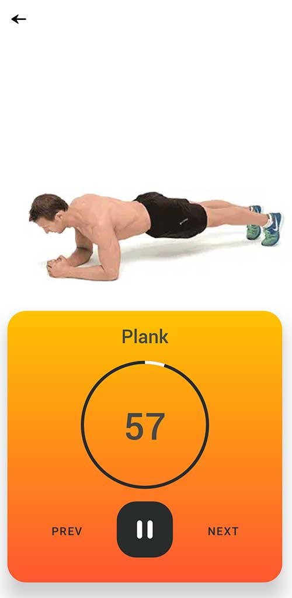
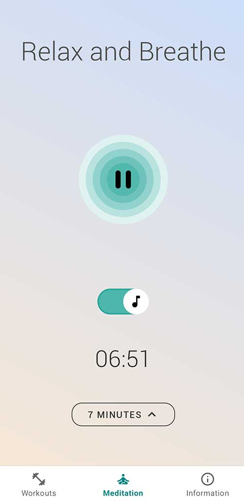
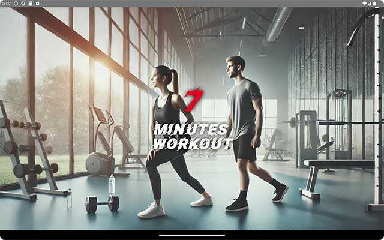
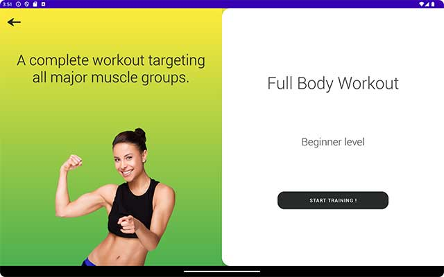
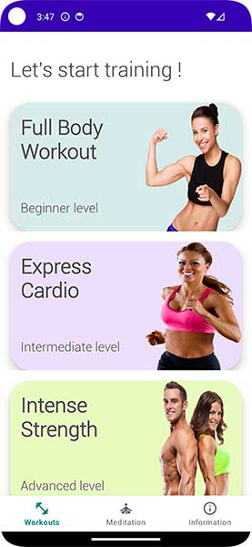
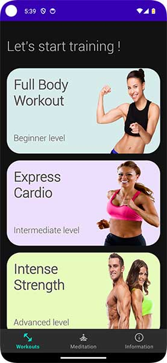

# 🏋️‍♂️ Seven Minutes Workout 🧘‍♀️
Welcome to the **7-Minute Workout App**! This app is designed to offer users a quick yet effective workout routine coupled with relaxing meditation sessions, all in one platform.

## 🚀 Features

- **7-Minute Workout:** Start quick workout routines specifically designed to give maximum impact in minimum time.
- **Meditation Sessions:** Choose from different guided meditation durations (1, 3, 5, or 7 minutes).
- **Dark Mode Support:** Beautiful themes available for both light and dark modes.
- **Adaptive UI:** Automatically adapts UI for tablet and mobile devices.

<p align="center">
    
    
    
</p>

## 📲 Getting Started

### Prerequisites

- **Android Studio** - Install the latest version to open and run this project.
- **JDK 11 or above** - Required to compile the code.

### Installation

1. **Clone the repository**
   ```bash
   git clone https://github.com/tabodino/sevenminutesworkout.git
   cd sevenminutesworkout

    Open in Android Studio
        Go to File > Open and select the project folder.

    Build & Run
        Connect your Android device or emulator.
        Click Run to install and test the app.

🎨 App Screenshots

Adaptative UI

<p align="center">
   	
   
</p>
Light & Dark Mode

<p align="center">
   	
   
   
   
</p>


📂 Project Structure

The architecture aims to follow Domain-Driven Design principles.


```
+---data
|   # Contains raw data or mechanisms for accessing data such as files, databases, or external APIs.
|
+---di
|   # "Dependency Injection" folder: Manages the configuration of dependencies, allowing services to be injected in a modular and testable way.
|
+---domain
|   # Represents the "Domain" layer of the application, where business logic resides. It contains models, repositories, and services that manage business rules.
|
|   +---model
|   |   # Contains domain models or entities, representing the core objects of the domain (e.g., Workout, Exercise, etc.).
|   |
|   +---repository
|   |   # Contains the interfaces or classes responsible for handling data persistence, interacting with databases or other data sources.
|   |
|   \---service
|       # Contains domain services that encapsulate complex business logic (e.g, TimerManager).
|
+---presentation
|   # Represents the "Presentation" (or "UI") layer, where the display and interaction logic of the application is defined.
|
|   +---adapter
|   |   # Adapter classes that convert data between the "domain" model and the "presentation" layer for easier communication between the two.
|   |
|   +---animation
|   |   # Contains resources or components related to animations in the user interface.
|   |
|   \---ui
|       # User interface components, organized by function or domain of the application.
|
|       +---information
|       |   # UI components related to displaying health information
|       |
|       +---meditation
|       |   # UI components related to a meditation feature (screens, buttons, etc.).
|       |
|       +---network
|       |   # UI components for network-related functionality, such as managing connections or displaying network data.
|       |
|       \---workout
|           # UI components related to a workout or fitness feature.
|
\---util
    # Contains utility functions and helpers that are used across the entire project, such as data formatting or extensions.

    
```

🔍 Testing
Running Unit Tests

Run all unit tests:

```bash

./gradlew test

```

Running Instrumentation Tests

Run all UI tests:

```bash

./gradlew connectedAndroidTest

```

✨ Contributing

Contributions are welcome! Please fork the repository, create a feature branch, and submit a pull request.

📄 License

This project is licensed under the MIT License.